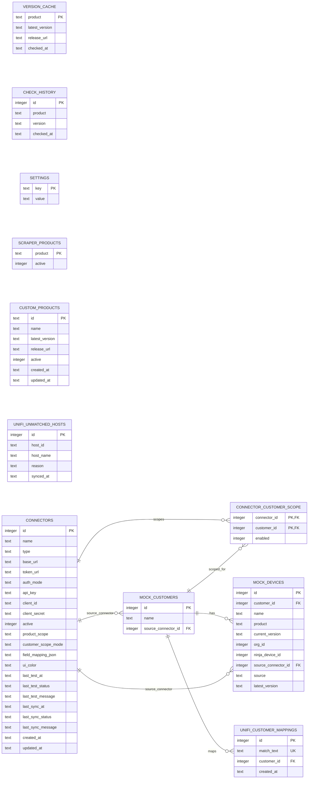

# Datenbank-Diagramm

```mermaid
erDiagram
    direction LR

    VERSION_CACHE {
        text product PK
        text latest_version
        text release_url
        text checked_at
    }

    CHECK_HISTORY {
        integer id PK
        text product
        text version
        text checked_at
    }

    SETTINGS {
        text key PK
        text value
    }

    SCRAPER_PRODUCTS {
        text product PK
        integer active
    }

    CUSTOM_PRODUCTS {
        text id PK
        text name
        text latest_version
        text release_url
        integer active
        text created_at
        text updated_at
    }

    MOCK_CUSTOMERS {
        integer id PK
        text name
        integer source_connector_id FK
    }

    MOCK_DEVICES {
        integer id PK
        integer customer_id FK
        text name
        text product
        text current_version
        integer org_id
        integer ninja_device_id
        integer source_connector_id FK
        text source
        text latest_version
    }

    UNIFI_CUSTOMER_MAPPINGS {
        integer id PK
        text match_text UK
        integer customer_id FK
        text created_at
    }

    UNIFI_UNMATCHED_HOSTS {
        integer id PK
        text host_id
        text host_name
        text reason
        text synced_at
    }

    CONNECTORS {
        integer id PK
        text name
        text type
        text base_url
        text token_url
        text auth_mode
        text api_key
        text client_id
        text client_secret
        integer active
        text product_scope
        text customer_scope_mode
        text field_mapping_json
        text ui_color
        text last_test_at
        text last_test_status
        text last_test_message
        text last_sync_at
        text last_sync_status
        text last_sync_message
        text created_at
        text updated_at
    }

    CONNECTOR_CUSTOMER_SCOPE {
        integer connector_id PK, FK
        integer customer_id PK, FK
        integer enabled
    }

    MOCK_CUSTOMERS ||--o{ MOCK_DEVICES : has
    MOCK_CUSTOMERS ||--o{ UNIFI_CUSTOMER_MAPPINGS : maps
    CONNECTORS ||--o{ CONNECTOR_CUSTOMER_SCOPE : scopes
    MOCK_CUSTOMERS ||--o{ CONNECTOR_CUSTOMER_SCOPE : scoped_for

    CONNECTORS ||--o{ MOCK_CUSTOMERS : source_connector
    CONNECTORS ||--o{ MOCK_DEVICES : source_connector
```